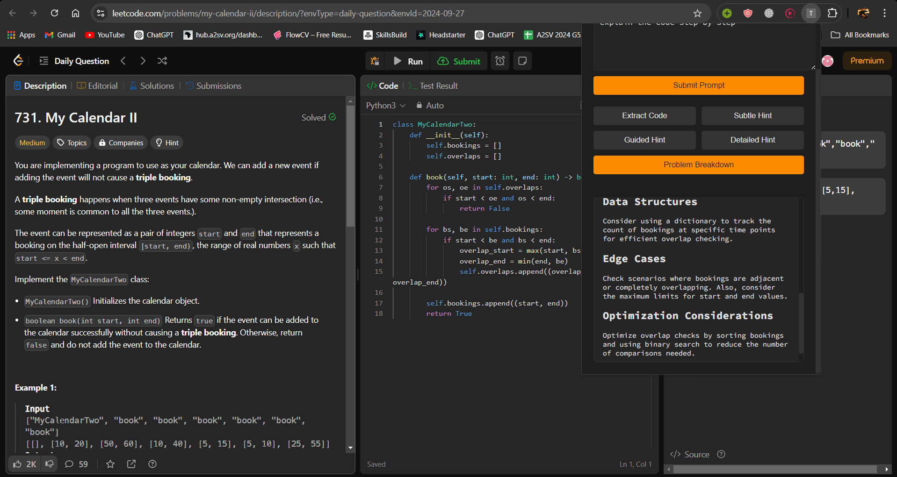
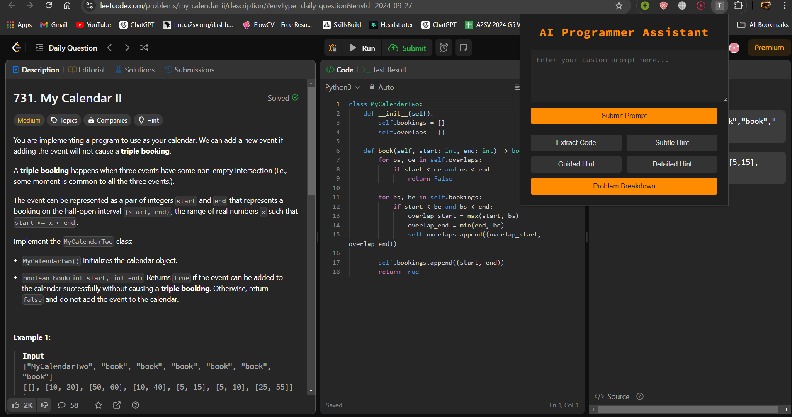
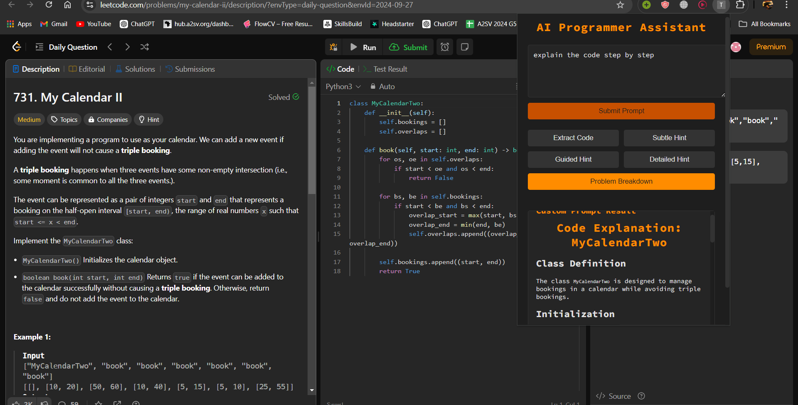

# LeetCode Assistant

LeetCode Assistant is a Chrome extension that helps competitive programmers by offering hints, breaking down questions, and providing detailed explanations for LeetCode problems. Additionally, users can interact with the assistant to clarify doubts or ask questions about the code or problem.

## Features

1. **Hints**: The extension provides hints at three levels:
   - **Subtle**: Minimal guidance to encourage problem-solving.
   - **Guided**: More focused hints that steer the user in the right direction.
   - **Detailed**: Full hints or walkthroughs for a problem.
   
2. **Question Breakdown**: The extension simplifies complex problems into digestible chunks to make them easier to understand.

3. **Chat with Extension**: Users can ask the assistant specific questions about the code or LeetCode problem for further clarification.

---

## Project Structure

```
CodeAssistant
│
├── backend/
│   ├── venv/
│   └── main.py  # FastAPI backend for handling AI requests
│
├── Extension/
│   ├── prisma/
│   ├── background.js  # Handles background actions for the Chrome extension
│   ├── content.js
│   ├── manifest.json  # Chrome extension manifest
│   ├── popup.html  # The UI for the popup
│   ├── popup.js  # Handles frontend logic for the popup, including button actions
│   ├── styles.css 
│
├── .env
├── .gitignore
└── requirements.txt
```

---

## Installation

### Backend (FastAPI + AI Integration)
1. **Clone the repository**:
   ```bash
   git clone [https://github.com/your-repo/leetcode-assistant.git](https://github.com/TNAHOM/CodeAssist-chromeExtension.git)
   cd CodeAssist-chromeExtension/backend
   ```

2. **Create and activate a virtual environment**:
   ```bash
   python -m venv venv
   source venv/bin/activate  # On Windows: venv\Scripts\activate
   ```

3. **Install dependencies**:
   ```bash
   pip install -r requirements.txt
   ```

4. **Set up environment variables**:
   - Create a `.env` file in the `backend` folder and set your `GITHUB_TOKEN`:
     ```
     GITHUB_TOKEN=your_github_token_here
     ```

5. **Run the FastAPI server**:
   ```bash
   uvicorn main:app --reload
   ```

### Chrome Extension
1. **Enable Developer Mode** in Chrome.
2. **Load Unpacked Extension**: 
   - Navigate to `chrome://extensions/`
   - Click "Load unpacked" and select the `Extension` directory from this repository.
3. **Set the `GITHUB_TOKEN`**: 
   - The `.env` file must contain your valid `GITHUB_TOKEN` to access the GitHub model marketplace API.

---

## Usage

1. **Scraping Code and Questions**:
   - After installing the extension, navigate to a LeetCode problem.
   - The extension will scrape the code and the question when you click the relevant buttons on the popup.

2. **Hint Generation**:
   - Click the **Hint** button to get a hint at the selected level (Subtle, Guided, or Detailed). The AI will generate a helpful hint based on the question.
   -  


3. **Question Breakdown**:
   - Click the **Breakdown** button to receive a simpler breakdown of the current LeetCode problem.
   -  

4. **Chat with the Assistant**:
   - You can ask specific questions or clarifications about the code or the problem by interacting with the assistant.
   -   

---

## Dependencies

- **Backend**:
  - FastAPI
  - OpenAI SDK
  - Uvicorn
  - Any additional libraries in `requirements.txt`

- **Frontend**:
  - Chrome Extension APIs
  - Prism.js (for code syntax highlighting)
  
---

---

Let me know if you want to make any further adjustments or if anything else is needed!
